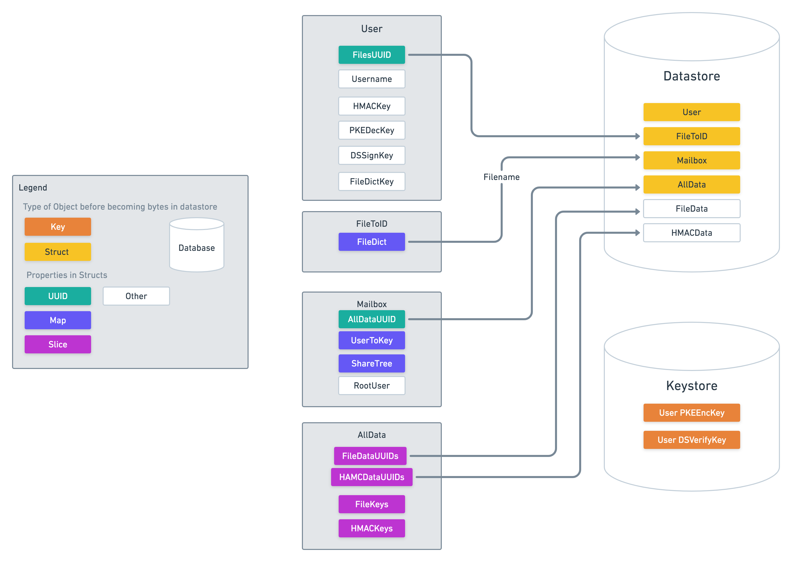

System Design
=============

Overview
--------

This end-to-end encrypted file service is based on a “mailbox”-like system. Every file has it’s own central place where all it’s information is stored and updated. Any verified user enters this central area to receive mail (receive updates) or send mail (push updates). We rely on a couple of different structs to make this all happen, which you can reference in Figure 1 and in the below descriptions:

**User**: We use the `User` struct to represent separate owners/readers/writers of files in the system. Every `User` has a `FilesUUID` field which holds a UUID to a `FileToID` struct. There are also other fields that a User holds (see Figure 1).

**FileToID**: A map of filename to UUID. The UUID is UUID of the file’s central “mailbox”. We hashed the filename as the key so that adversaries cannot determine the name or length.

**Mailbox**: Every file has it’s own mailbox that holds some metadata. It contains a `RootUser` field which is the Username of the owner, encrypted with that user’s public key. We also have a field `AllDataUUID`, the UUID of the `AllData` struct where the main file information is stored. The mailbox also holds the sharing data which consists of a `ShareTree` map and a `UserToKey` map. The `ShareTree` maps a Username to a list of users that User has shared the file with. The `UserToKey` maps a Username to an encrypted `AllData` decryption key that only that User can decrypt, which gives only that user access to the `AllData` struct.

**AllData**: The `AllData` struct holds UUIDS and keys for files and HMAC tags. The `FileDataUUIDs` field is a 2D slice where each index corresponds to a UUID of a file “piece”. We have another 2D slice of symmetric keys stored in `FileKeys` so a User can decrypt the corresponding file. Similarly, we have `HMACDataUUIDs` and `HMACKeys` to ensure the integrity of the file.

File Questions
--------------

1.  How is a file stored on the server?

    To store a new file, we create a new index in the User’s `FileToID` struct which assigns this file a new UUID for it’s `Mailbox`. We first set the `RootUser` to the caller of `StoreFile` and encrypt that field with the caller’s public key so that we can verify them as the owner of the file. To set the rest of the variables in the Mailbox, we must initialize a new `AllData` struct and add it’s variables. We encrypt the actual file data with a random symmetric key and put the encrypted data in the Datastore at a newly generated UUID. We then save the file UUID and key in `AllData` struct, along with it’s HMAC data and HMAC key. We finalize storing the file by encrypting the `AllData` struct using a random symmetric key, encrypting that encryption key with the root User’s public key, saving the key in the `UserToKey` map (in the Mailbox) and finally saving the UUID of the `AllData` struct in the `Mailbox`. Now the user now has access to the `AllData` struct, and thus the file data.

2.  How does a file get shared with another user?

    Whenever a file is shared with another user, we update the `ShareTree` inside the file’s `Mailbox` by adding the receiver to the sender’s list of shared users. We then grant the receiver a key to actually decrypt the `AllData` struct by encrypting the `AllData` key with the receiver’s public key. This is added to the receiver’s entry in the `UserToKey` map. Only that user can use that key because the key itself is encrypted with the user’s public key. Finally we can return the access token which will contain the receiver’s username, the UUID of file’s `Mailbox`, and the sender’s username. This token is encrypted with the receiver’s public key and signed with the sender’s digital signature to ensure both confidentiality and integrity. Furthermore, in `ReceiveFile` we can check the receiver username in the access token to ensure the caller is the intended receiver.

3.  What is the process of revoking a user’s access to a file?

    First, we can verify that the revoker is the owner of the file by decrypting the `RootUser` field with their private key and checking the Username. Revoking a user consists of re-encrypting the `AllData` struct, re-sharing the new key to only “unrevoked” users, and finally re-encrypting the file and hmac data. We iterate through the `ShareTree` to get the revoked user and all of it’s children until there are no more children to be revoked. We update `UserToKey` with the new key for only those users who are not revoked (found above). Finally, we re-encrypt the file and the hmac data and store the new keys in `AllData`. Since we’ve already updating the sharing access to `AllData`, the files can now only be accessed by those who have access to the newly encrypted `AllData` struct.

4.  How does your design support efficient file append?

    In the `AllData` struct, we generate a new UUID for this new file “piece”, and save the new UUID in the `FileDataUUIDs` slice at the next available index. We encrypt the new file data with a randomly generated key and insert the encrypted data at the new UUID. We then save the random key at the corresponding index in `FileKeys`. Finally, we can follow similar steps to generate the HMAC data and keys for the new file piece. This is efficient because we don’t have to download and decrypt older file pieces to add data to a file - we just store the pieces separately.

 [fig:sys]

Security Analysis
=================

Our system achieves confidentiality, integrity, and authentication through cryptography (both symmetric and asymmetric cryptography), HMAC tags, and Digital Signatures. In our system we generally use symmetric cryptography to encrypt structs and data that need to be accessible to multiple users like our `AllData` struct and the file data. We never reuse keys that we use in these symmetric encryption schemes. The keys are randomly or deterministically generated depending on their use, but each have their own purpose.

We use asymmetric cryptography to encrypt structs that should only be accessible to a specific user. For example, in our system the root user and the key to the `AllData` struct are encrypted public keys. The root user of any file is encrypted with the owner’s public key so that in `RevokeUser` we can verify that the User revoking access is the owner of the file. Also, when we want to share access to a certain file, we can encrypt the key to the `AllData` struct with a User’s public key so only they have access to the key.

To ensure integrity in our design, we use HMACs on files and user structs. Anytime we store a file or append a file, we store the HMAC of the data and the HMAC keys in the`AllData` struct. Every time we want to load a file, we are able to verify that the file hasn’t been tampered with by checking the HMAC tag. We also append an HMAC tag to the encrypted user struct and store that in the datastore so in `GetUser` we can verify the integrity of the User struct by comparing the tag with a new HMAC of the encrypted data. We also use digital signatures to authenticate users who have sent tokens. We sign the access token and verify the senders signature in `ReceiveFile`.

Threat 1: 
----------

One threat is a naive dictionary attack on passwords. In this attack, the adversary is looking for common hashes in the Datastore and trying to uncover passwords so they can run GetUser with the username and password. Our system protects against a naive attack like this because never store a hash of the password, nor do we ever use a hash of a password in our code at all. We designed a system that encrypts and decrypts the User struct without ever needing to download a saved password. Instead, we deterministically generate a “base key” using `userlib.Argon2Key` based on the given usernames and passwords. This base key is used to first encrypt the User struct, meaning it can only ever be decrypted if the same password is inputted in GetUser. No password or hash or combination of username and password is ever stored on the Datastore server so trying to match common password hashes to data in the public datastore isn’t sufficient.

Threat 2:
---------

We can assume that an adversary can also and modify any accesstoken(s) generated by ShareFile when users share files with each other. Knowing this, assume a malicious user intercepts an access token sent between the intended sender and receiver of the access token. By intercepting this, the malicious user can send a new fake access token to the receiver, disguised as the sender. Our system protects against this utilizing RSA Encryption. The `Access Token` struct is encrypted using the receivers public key, that way only the receiver can decrypt using their private key. The sender then signs the encrypted `Access Token` struct suing their private signature key. We then create the returned magic string as a concatenation of the the encrypted `Access Token` struct and signature. Once the receiver obtains the magic string they verify the signature using the sender’s public key. Once verified they decrypt the string using their own RSA private key. This stops the malicious user from posing as the sender or modifying with the access token.

Threat 3: 
----------

We assume that the adversary controls one or more malicious users. It is possible that a legitimate user might share a file with a malicious user. The adversary can record all relevant information about the file (including any cryptographic material and any accesstoken(s) generated by ShareFile) and remember it, even if access to the file is later revoked. Our system protects against this in our methodology of revoking a user’s access to a file. When revoking, we generate new random encryption keys, reencrypt the raw data with these keys, then save these keys. We then generate a new key for encrypting the `AllData` struct, encrypt the struct, then save this encryption key for each user that still has access as previous mentioned. Because the malicious no longer has a access, they no longer know the proper decryption keys and can therefor no longer decrypt the file data. The access token does not reveal any information on how to deccrypt the file data and therefore by injecting and seeing an access token, they gain no useful information.
