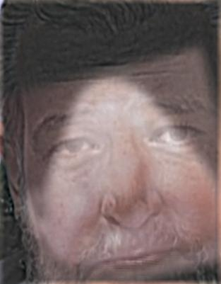
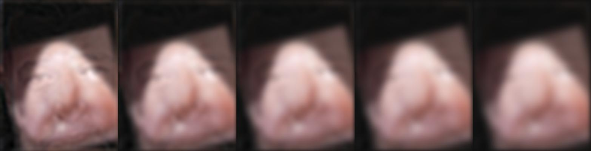

🔴 Project 2: Fun with Frequencies  {color: #5e9ca0;}
================================

Part 1: Fun with Filters {style="color: #2e6c80;"}
------------------------

#### Part 1.1: Finite Difference Operator

I began by creating two finite difference operators, one in the x
direction, Dx, and one in the y direction, Dy. I then computed the the
partial derivative x and y by using scipy.signal.conv2d to convolve the
image with Dx and Dy seperately. To compute the gradient magnitude, I
summed the sqaures of the partial derivatives then  took the square root
of that. Finally, to turn this into an edge image and to suppress some
noise, I binarized the gradient magnitude image by using a threshold =
0.15. Below are my results:

+--------------------------------------+--------------------------------------+
| *partial          | y](output/11_dy.jpg)partial          |
|  derivative of x*                    |  derivative of y*                    |
+--------------------------------------+--------------------------------------+
| ***gradient  | image](output/11_binmag.jpg)binarize |
| magnitude*                           | d                                    |
|                                      | edge image*                          |
+--------------------------------------+--------------------------------------+

####  

#### Part 1.2: Derivative of Gaussiam (DoG) Filter

I first created a blurred version of the original image by convolving
the image with a 2 dimensional gaussian, using scipy.signal.convolve2d
and cv2.getGaussianKernel(). I repeated the steps from 1.1, convolving
the blurred image with Dx and Dy and computing the gradient magnitude
and binarized edge image, with a threshold = 0.08. Here are my results:

+--------------------------------------+--------------------------------------+
| **       | image](output/12_bin.jpg)*           |
|                                      |                                      |
| *gradient magnitude*                 | *binarized edge image*               |
+--------------------------------------+--------------------------------------+

 

Compared to the results from 1.1, there is much less noise. This is a
result of blurring the image before the convolution. 

I then put these steps into a single convolution by creating a
derivative of gaussian filters. I convolve the gaussian with Dx and Dy,
and apply  the same threshold as before. Below are DoG filters as images
and the resulting gradient and edge image.

+--------------------------------------+--------------------------------------+
| **  | **  |
|                                      |                                      |
| *DoG for Dx*                         | *DoG for Dy*                         |
+--------------------------------------+--------------------------------------+

 

+--------------------------------------+--------------------------------------+
| **      | image](output/12_bin2.jpg)*          |
|                                      |                                      |
| *gradient magnitude*                 | *binarized edge image*               |
+--------------------------------------+--------------------------------------+

#### Part 1.3: Image Straightening 

Here we automated straightening images. For each image, I looked at 50
angles between -20 and 20 degrees. For each angle, I rotated the image
using scipy.ndimage.interpolation.rotate. I then cropped the rotated
image to only compute the gradient angles of the center of the image.
After computinh the partical derivatives of both x and y, and using
these to compute the gradient angles of image (arctan(-dy/dx)), I  then
summed up the number of horizontal and verticle edges in the image. I
compared the summed total of horizontal and verticle edges for each
angle, and determine the angle that produced the highest sum to be the
straightest. Below are my results.

Facade image: rotated -2.04 degrees

+--------------------------------------+--------------------------------------+
| **    | facade](output/13_rot_facade.jpg)*   |
|                                      |                                      |
| *original facade*                    | *rotated facade*                     |
+--------------------------------------+--------------------------------------+
| **                                | .jpg)*                               |
|                                      |                                      |
| *original orientation histogram*     | *rotated orientation histogram*      |
+--------------------------------------+--------------------------------------+

 Austin Skyline image: rotated -11.84 degrees

+--------------------------------------+--------------------------------------+
| **    | facade](output/13_rot_austin.jpg)*   |
|                                      |                                      |
| *original austin*                    | *rotated austin*                     |
+--------------------------------------+--------------------------------------+
| **                                | .jpg)*                               |
|                                      |                                      |
| *original orientation histogram*     | *rotated orientation histogram*      |
+--------------------------------------+--------------------------------------+

Leaning Tower of Pisa image: rotated 4.49 degrees

+--------------------------------------+--------------------------------------+
| **      | facade](output/13_rot_pisa.jpg)*     |
|                                      |                                      |
| *original pisa*                      | *rotated pisa*                       |
+--------------------------------------+--------------------------------------+
| **                                  | pg)*                                 |
|                                      |                                      |
| *original orientation histogram*     | *rotated orientation histogram*      |
+--------------------------------------+--------------------------------------+

[FAILED] Round candy: rotated -15.9 degrees. The automated rotation
failed in this case because it utilizes straight edges, whereas this
image has minimal straight edges.

+--------------------------------------+--------------------------------------+
| **     | facade](output/13_rot_candy.jpg)*    |
|                                      |                                      |
| *original round candy*               | *rotated round candy*                |
+--------------------------------------+--------------------------------------+
| **                                 | jpg)*                                |
|                                      |                                      |
| *original orientation histogram*     | *rotated orientation histogram*      |
+--------------------------------------+--------------------------------------+

Part 2: Fun with Frequencies
----------------------------

#### Part 2.1: Image Sharpening

Here we derive the unsharp masking technique. The first step is to
create a low-pass filter, I used a gaussian filter, that retains the low
frequencies. To get the high freqencies of the image, I subtract the
low-frequecies from the origial image. To "sharpen" the image, I simply
add the high frequencies back into the original image. I combined this
into one colvolution, creating the unsharp mask filter, which follows
the following equation: sharp\_image = ((alpha + 1) \* original\_image)
- (alpha \* low\_pass\_image). I attempted to get rid of the dimming
effect by normalizing the output, clipping the output, and trying
various different saving methods (plt vs skimg.io). Unfortunatetly, I
was unable to fully get rid of the dimming effect. Below are my results.

+--------------------------------------+--------------------------------------+
| **        | image](output/21_sharp_taj.jpg)*     |
|                                      |                                      |
| *original image*                     | *sharpening image*                   |
+--------------------------------------+--------------------------------------+

 

+--------------------------------------+--------------------------------------+
| **     | image](output/21_sharp_flower.jpg)*  |
|                                      |                                      |
| *original image*                     | *sharpening image*                   |
+--------------------------------------+--------------------------------------+

For evaluation. I picked a sharp image, blurred it using a gaussian
filter, then passed this blurred image through the unsharp mask filter
to obtaint the originail image.

+--------------------------+--------------------------+--------------------------+
| * | image](output/blurred_pu | image](output/21_sharp_p |
| *                        | ppy.jpg)*                | uppy.jpg)*               |
|                          |                          |                          |
| *original sharp image*   | *blurred image*          | *sharpened blurred       |
|                          |                          | image*                   |
+--------------------------+--------------------------+--------------------------+

#### Part 2.2: Hybrid Images

The basic idea of the hybrid image is that up close, the high
 frequencies dominate our perception, but far away, the low frequencies
dominate. I took two images, one to dominate low frequencies, and one to
dominate high frequencies. I used a guassian filter to create a low
 pass of image 1 and followed a similar technique as in 2.1 to obtain
the high-frequencies of image 2. To compute the hybrid image, I simply
take the average of the low-pass image summed with high-pass image.
Below are my results.

Derek and his cat

+--------------------------+--------------------------+--------------------------+
| **                 | )*                       | at.jpg)*                 |
|                          |                          |                          |
| *image 1*                | *image 2*                | *hybrid image*           |
+--------------------------+--------------------------+--------------------------+

 

Ted cruz and blob fish... yes, the resemblance IS uncanny

+--------------------------+--------------------------+--------------------------+
| **                    | pg)*                     | ob.jpg)*                 |
|                          |                          |                          |
| *image 1*                | *image 2*                | *hybrid image*           |
+--------------------------+--------------------------+--------------------------+

I also illustrate the process through frequency analysis by showing the
log magnitude of the Fourier transform of the two input images, the
filtered images, and the hybrid image. Below are my results

Labradoodle Puppy and corresponding fourier transforms

+----------------+----------------+----------------+----------------+----------------+
| **    | 1](output/22_l | mage2.jpg)*    | 2](output/22_h | 22_fft_hybrid. |
|                | owpass.jpg)*   |                | ighpass.jpg)*  | jpg)*          |
| *image 1*      |                | *image 2*      |                |                |
|                | *low-pass of   |                | *high pass of  | *hybrid image* |
|                | image 1*       |                | image 2*       |                |
+----------------+----------------+----------------+----------------+----------------+
| **     | ft_2.jpg)*     | ft_3.jpg)*     | ft_4.jpg)*     | ft_5.jpg)*     |
|                |                |                |                |                |
| *FFT*          | *FFT*          | *FFT*          | *FFT*          | * FFT*         |
+----------------+----------------+----------------+----------------+----------------+

#### Part 2.3: Gaussian and Laplacian Stacks

To create the gaussian stack, I apply the Gaussian filter at each level,
creating a subquently more low-pass filtered image at each level. To
create each level of laplacian stack, I take the difference of the
guassian stack at the level and the following level, create a high-pass
filtered image at each level. For the following images, I choose to
implement 5 levels. Here are my results.

+--------------------------------------------------------------------------+
| **                                     |
|                                                                          |
| *original image*                                                         |
+--------------------------------------------------------------------------+
| **                                |
|                                                                          |
| *gaussian stack*                                                         |
+--------------------------------------------------------------------------+
| **                                |
|                                                                          |
| *laplacian stack*                                                        |
+--------------------------------------------------------------------------+

 

+--------------------------------------------------------------------------+
| **                             |
|                                                                          |
| *original image*                                                         |
+--------------------------------------------------------------------------+
| **                                |
|                                                                          |
| *gaussian stack*                                                         |
+--------------------------------------------------------------------------+
| **                                |
|                                                                          |
| *laplacian stack*                                                        |
+--------------------------------------------------------------------------+

 

 

#### Part 2.4: Multiresolution Blending

The goal is two blend two images seamlessly using a multiresolution
blending. To do so, I will be utilizing guassian and laplacian stacks. I
begin by computing the gaussian and laplacian stacks for two images,
again using 5 levels for each stack. I also create  a gaussian stack for
my mask image. To create the blended image I follow the following
equation LSl(i, j) = GRl(i, j)LAl(i, j) + (1 - GRl(i, j))LBl(i, j).
Where A and B are the images to be blended together and R is the mask. I
then sum LS to create the final blended image. Below are my results

+--------------------+--------------------+--------------------+--------------------+
| **         | range.jpg)*        | ask1.jpg)*         | image](output/24_b |
|                    |                    |                    | lend1.jpg)*        |
| *image 1*          | *image 2*          | *mask*             |                    |
|                    |                    |                    | *blended image*    |
+--------------------+--------------------+--------------------+--------------------+

 

+--------------------+--------------------+--------------------+--------------------+
| **          | ed.jpg)*           | ask2.jpg)*         | image](output/24_b |
|                    |                    |                    | lend2.jpg)*        |
| *image 1*          | *image 2*          | * mask*            |                    |
|                    |                    |                    | *blended image*    |
+--------------------+--------------------+--------------------+--------------------+

To illustrate the process, I applied the Laplacian stack to the blended
image, showcasing the mask that created it.

 

+--------------------+--------------------+--------------------+--------------------+
| **         | ol.jpg)*           | ask3.jpg)*         | image](output/24_b |
|                    |                    |                    | lend3.jpg)*        |
| *image 1*          | *image 2*          | * mask*            |                    |
|                    |                    |                    | *blended image*    |
+--------------------+--------------------+--------------------+--------------------+

+--------------------------------------------------------------------------+
| **                                 |
|                                                                          |
| *laplacian for mask*                                                     |
+--------------------------------------------------------------------------+
| **                                      |
|                                                                          |
| *laplacian for blended image*                                            |
+--------------------------------------------------------------------------+

-
