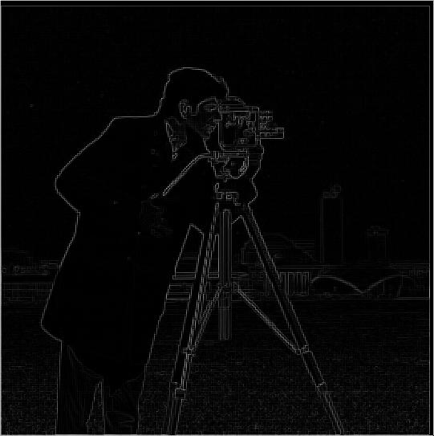
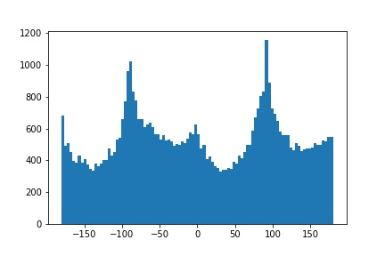
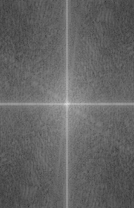
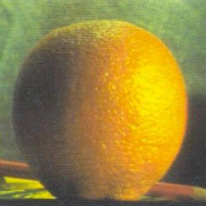
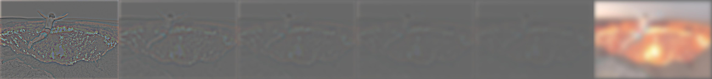

Project 2: Fun with Frequencies&nbsp;
Part 1: Fun with Filters
#### Part 1.1: Finite Difference Operator
I began by creating two finite difference operators, one in the x direction, Dx, and one in the y direction, Dy. I then computed the the partial derivative x and y by using&nbsp;scipy.signal.conv2d to convolve the image with Dx and Dy seperately. To compute the gradient magnitude, I summed the sqaures of the partial derivatives then &nbsp;took the square root of that. Finally, to turn this into an edge image and to suppress some noise, I&nbsp;binarized the gradient magnitude image by using a threshold = 0.15. Below are my results:

partial &nbsp;derivative of x
partial &nbsp;derivative of y

gradient magnitude

binarized edge image

#### &nbsp;
#### Part 1.2: Derivative of Gaussiam (DoG) Filter
I first created a blurred version of the original image by&nbsp;convolving the image with a 2 dimensional gaussian, using&nbsp;scipy.signal.convolve2d and&nbsp;cv2.getGaussianKernel(). I repeated the steps from 1.1, convolving the blurred image with Dx and Dy and computing the gradient magnitude and binarized edge image, with a threshold = 0.08. Here are my results:

gradient magnitude

binarized edge image

&nbsp;
Compared to the results from 1.1, there is much less noise. This is a result of blurring the image before the convolution.&nbsp;
I then put these steps into a single convolution&nbsp;by creating a derivative of gaussian filters. I convolve the gaussian with Dx and Dy, and apply &nbsp;the same threshold as before. Below are DoG filters as images and the resulting gradient and edge image.

DoG for Dx

DoG for Dy

&nbsp;

gradient magnitude

binarized edge image

#### Part 1.3: Image Straightening&nbsp;
Here we automated straightening images. For each image, I looked at 50 angles between -20 and 20 degrees. For each angle, I rotated the image using&nbsp;scipy.ndimage.interpolation.rotate. I then cropped the rotated image to only compute the gradient angles of the center of the image. After computinh the partical derivatives of both x and y, and using these to compute the gradient angles of image (arctan(-dy/dx)), I &nbsp;then summed up the number of horizontal and verticle edges in the image. I compared the summed total of horizontal and verticle edges for each angle, and determine the angle that produced the highest sum to be the straightest. Below are my results.
Facade image: rotated -2.04 degrees

original facade

rotated facade

original orientation histogram

rotated orientation histogram

&nbsp;Austin Skyline image: rotated -11.84 degrees

original austin

rotated austin

original orientation histogram

rotated orientation histogram

Leaning Tower of Pisa image: rotated 4.49 degrees

original pisa

rotated pisa

original orientation histogram

rotated orientation histogram

[FAILED] Round candy: rotated -15.9 degrees. The automated rotation failed in this case because it utilizes straight edges, whereas this image has minimal straight edges.

original round candy

rotated round candy

original orientation histogram

rotated orientation histogram

## Part 2: Fun with Frequencies
#### Part 2.1: Image Sharpening
Here we derive the&nbsp;unsharp masking technique. The first step is to create a low-pass filter, I used a gaussian filter, that retains the low frequencies. To get the high freqencies of the image, I subtract the low-frequecies from the origial image. To "sharpen" the image, I simply add the high frequencies back into the original image. I combined this into one colvolution, creating the&nbsp;unsharp mask filter, which follows the following equation:&nbsp;sharp_image = ((alpha + 1) * original_image) - (alpha * low_pass_image). I attempted to get rid of the dimming effect by normalizing the output, clipping the output, and trying various different saving methods (plt vs skimg.io). Unfortunatetly, I was unable to fully get rid of the dimming effect.
Below are my results. 

original image

sharpening image

&nbsp;

original image

sharpening image

For evaluation. I picked a sharp image, blurred it using a gaussian filter, then passed this blurred image through the unsharp mask filter to obtaint the originail image.

original sharp image

blurred image

sharpened blurred image

#### Part 2.2: Hybrid Images
The basic idea of the hybrid image is that up close, the high &nbsp;frequencies dominate our perception, but far away, the low frequencies dominate. I took two images, one to dominate low frequencies, and one to dominate high frequencies. I used a guassian filter to create a low &nbsp;pass of image 1 and followed a similar technique as in 2.1 to obtain the high-frequencies of image 2. To compute the hybrid image, I simply take the average of the low-pass image summed with high-pass image. Below are my results.
Derek and his cat

image 1

image 2

hybrid image

&nbsp;
Ted cruz and blob fish...  yes, the resemblance IS uncanny

image 1

image 2

hybrid image

I also&nbsp;illustrate the process through frequency analysis by&nbsp;showing the log magnitude of the Fourier transform of the two input images, the filtered images, and the hybrid image. Below are my results
Labradoodle Puppy and corresponding fourier transforms

image 1

low-pass of image 1

image 2

high pass of image 2

hybrid image

FFT

FFT

FFT

FFT

&nbsp;FFT

#### Part 2.3: Gaussian and Laplacian Stacks
To create the gaussian stack, I&nbsp;apply the Gaussian filter at each level, creating a subquently more low-pass filtered image at each level. To create each level of laplacian stack, I take the difference of the guassian stack at the level and the following level, create a high-pass filtered image at each level. For the following images, I choose to implement 5 levels. Here are my results.

original image

gaussian stack

laplacian stack

&nbsp;

original image

gaussian stack

laplacian stack

&nbsp;
&nbsp;
#### Part 2.4: Multiresolution Blending
The goal is two&nbsp;blend two images seamlessly using a multiresolution blending. To do so, I will be utilizing guassian and laplacian stacks. I begin by computing the gaussian and laplacian stacks for two images, again using 5 levels for each stack. I also create &nbsp;a gaussian stack for my mask image. To create the blended image I follow the following equation&nbsp;LSl(i, j) = GRl(i, j)LAl(i, j) + (1 - GRl(i, j))LBl(i, j). Where A and B are the images to be blended together and R is the mask. I then sum LS to create the final blended image. Below are my results

image 1

image 2

mask

blended image

&nbsp;

image 1

image 2

&nbsp;mask

blended image

To illustrate the process, I applied the Laplacian stack to the blended image, showcasing the mask that created it.
&nbsp;

image 1

image 2

&nbsp;mask

blended image

laplacian for mask

laplacian for blended image

-
