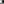
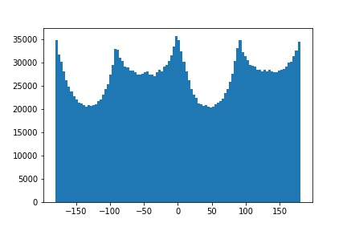
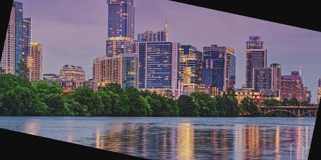
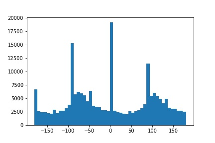
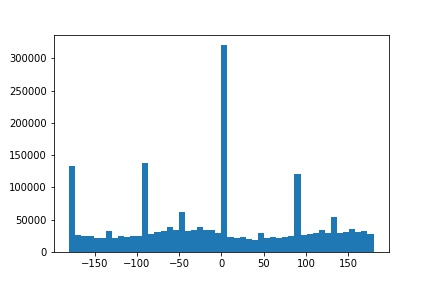
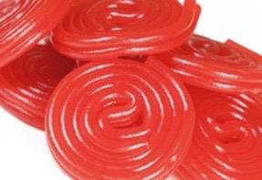
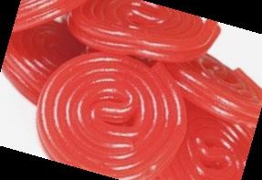
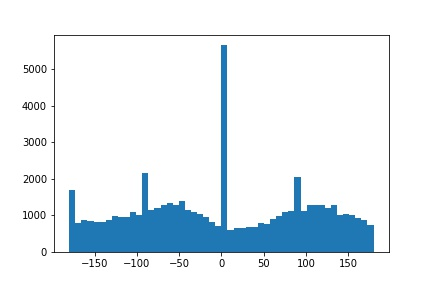
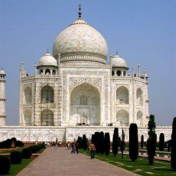

Project 2: Fun with Frequencies 
================================

Part 1: Fun with Filters
------------------------

#### Part 1.1: Finite Difference Operator

I began by creating two finite difference operators, one in the x direction, Dx, and one in the y direction, Dy. I then computed the the partial derivative x and y by using scipy.signal.conv2d to convolve the image with Dx and Dy seperately. To compute the gradient magnitude, I summed the sqaures of the partial derivatives then  took the square root of that. Finally, to turn this into an edge image and to suppress some noise, I binarized the gradient magnitude image by using a threshold = 0.15. Below are my results:

<table>
<col width="50%" />
<col width="50%" />
<tbody>
<tr class="odd">
<td align="left"><em>partial  derivative of x</em></td>
<td align="left"><em>partial  derivative of y</em></td>
</tr>
<tr class="even">
<td align="left">
<em></em><em>gradient magnitude</em>
</td>
<td align="left">
<em>binarized edge image</em>
</td>
</tr>
</tbody>
</table>

####  

#### Part 1.2: Derivative of Gaussiam (DoG) Filter

I first created a blurred version of the original image by convolving the image with a 2 dimensional gaussian, using scipy.signal.convolve2d and cv2.getGaussianKernel(). I repeated the steps from 1.1, convolving the blurred image with Dx and Dy and computing the gradient magnitude and binarized edge image, with a threshold = 0.08. Here are my results:

<table>
<col width="50%" />
<col width="50%" />
<tbody>
<tr class="odd">
<td align="left">
<em></em>

<em>gradient magnitude</em>
</td>
<td align="left">
<em></em>

<em>binarized edge image</em>
</td>
</tr>
</tbody>
</table>

 

Compared to the results from 1.1, there is much less noise. This is a result of blurring the image before the convolution. 

I then put these steps into a single convolution by creating a derivative of gaussian filters. I convolve the gaussian with Dx and Dy, and apply  the same threshold as before. Below are DoG filters as images and the resulting gradient and edge image.

<table>
<col width="50%" />
<col width="50%" />
<tbody>
<tr class="odd">
<td align="left">
<em></em>

<em>DoG for Dx</em>
</td>
<td align="left">
<em></em>

<em>DoG for Dy</em>
</td>
</tr>
</tbody>
</table>

 

<table>
<col width="50%" />
<col width="50%" />
<tbody>
<tr class="odd">
<td align="left">
<em></em>

<em>gradient magnitude</em>
</td>
<td align="left">
<em></em>

<em>binarized edge image</em>
</td>
</tr>
</tbody>
</table>

#### Part 1.3: Image Straightening 

Here we automated straightening images. For each image, I looked at 50 angles between -20 and 20 degrees. For each angle, I rotated the image using scipy.ndimage.interpolation.rotate. I then cropped the rotated image to only compute the gradient angles of the center of the image. After computinh the partical derivatives of both x and y, and using these to compute the gradient angles of image (arctan(-dy/dx)), I  then summed up the number of horizontal and verticle edges in the image. I compared the summed total of horizontal and verticle edges for each angle, and determine the angle that produced the highest sum to be the straightest. Below are my results.

Facade image: rotated -2.04 degrees

<table>
<col width="50%" />
<col width="50%" />
<tbody>
<tr class="odd">
<td align="left">
<em></em>

<em>original facade</em>
</td>
<td align="left">
<em></em>

<em>rotated facade</em>
</td>
</tr>
<tr class="even">
<td align="left">
<em></em>

<em>original orientation histogram</em>
</td>
<td align="left">
<em></em>

<em>rotated orientation histogram</em>
</td>
</tr>
</tbody>
</table>

 Austin Skyline image: rotated -11.84 degrees

<table>
<col width="50%" />
<col width="50%" />
<tbody>
<tr class="odd">
<td align="left">
<em></em>

<em>original austin</em>
</td>
<td align="left">
<em></em>

<em>rotated austin</em>
</td>
</tr>
<tr class="even">
<td align="left">
<em></em>

<em>original orientation histogram</em>
</td>
<td align="left">
<em></em>

<em>rotated orientation histogram</em>
</td>
</tr>
</tbody>
</table>

Leaning Tower of Pisa image: rotated 4.49 degrees

<table>
<col width="50%" />
<col width="50%" />
<tbody>
<tr class="odd">
<td align="left">
<em></em>

<em>original pisa</em>
</td>
<td align="left">
<em></em>

<em>rotated pisa</em>
</td>
</tr>
<tr class="even">
<td align="left">
<em></em>

<em>original orientation histogram</em>
</td>
<td align="left">
<em></em>

<em>rotated orientation histogram</em>
</td>
</tr>
</tbody>
</table>

[FAILED] Round candy: rotated -15.9 degrees. The automated rotation failed in this case because it utilizes straight edges, whereas this image has minimal straight edges.

<table>
<col width="50%" />
<col width="50%" />
<tbody>
<tr class="odd">
<td align="left">
<em></em>

<em>original round candy</em>
</td>
<td align="left">
<em></em>

<em>rotated round candy</em>
</td>
</tr>
<tr class="even">
<td align="left">
<em></em>

<em>original orientation histogram</em>
</td>
<td align="left">
<em></em>

<em>rotated orientation histogram</em>
</td>
</tr>
</tbody>
</table>

Part 2: Fun with Frequencies
----------------------------

#### Part 2.1: Image Sharpening

Here we derive the unsharp masking technique. The first step is to create a low-pass filter, I used a gaussian filter, that retains the low frequencies. To get the high freqencies of the image, I subtract the low-frequecies from the origial image. To "sharpen" the image, I simply add the high frequencies back into the original image. I combined this into one colvolution, creating the unsharp mask filter, which follows the following equation: sharp\_image = ((alpha + 1) \* original\_image) - (alpha \* low\_pass\_image). I attempted to get rid of the dimming effect by normalizing the output, clipping the output, and trying various different saving methods (plt vs skimg.io). Unfortunatetly, I was unable to fully get rid of the dimming effect. Below are my results.

<table>
<col width="50%" />
<col width="50%" />
<tbody>
<tr class="odd">
<td align="left">
<em></em>

<em>original image</em>
</td>
<td align="left">
<em></em>

<em>sharpening image</em>
</td>
</tr>
</tbody>
</table>

 

<table>
<col width="50%" />
<col width="50%" />
<tbody>
<tr class="odd">
<td align="left">
<em></em>

<em>original image</em>
</td>
<td align="left">
<em></em>

<em>sharpening image</em>
</td>
</tr>
</tbody>
</table>

For evaluation. I picked a sharp image, blurred it using a gaussian filter, then passed this blurred image through the unsharp mask filter to obtaint the originail image.

<table>
<col width="33%" />
<col width="33%" />
<col width="33%" />
<tbody>
<tr class="odd">
<td align="left">
<em></em>

<em>original sharp image</em>
</td>
<td align="left">
<em></em>

<em>blurred image</em>
</td>
<td align="left">
<em></em>

<em>sharpened blurred image</em>
</td>
</tr>
</tbody>
</table>

#### Part 2.2: Hybrid Images

The basic idea of the hybrid image is that up close, the high  frequencies dominate our perception, but far away, the low frequencies dominate. I took two images, one to dominate low frequencies, and one to dominate high frequencies. I used a guassian filter to create a low  pass of image 1 and followed a similar technique as in 2.1 to obtain the high-frequencies of image 2. To compute the hybrid image, I simply take the average of the low-pass image summed with high-pass image. Below are my results.

Derek and his cat

<table>
<col width="33%" />
<col width="33%" />
<col width="33%" />
<tbody>
<tr class="odd">
<td align="left">
<em></em>

<em>image 1</em>
</td>
<td align="left">
<em></em>

<em>image 2</em>
</td>
<td align="left">
<em></em>

<em>hybrid image</em>
</td>
</tr>
</tbody>
</table>

 

Ted cruz and blob fish... yes, the resemblance IS uncanny

<table>
<col width="33%" />
<col width="33%" />
<col width="33%" />
<tbody>
<tr class="odd">
<td align="left">
<em></em>

<em>image 1</em>
</td>
<td align="left">
<em></em>

<em>image 2</em>
</td>
<td align="left">
<em></em>

<em>hybrid image</em>
</td>
</tr>
</tbody>
</table>

I also illustrate the process through frequency analysis by showing the log magnitude of the Fourier transform of the two input images, the filtered images, and the hybrid image. Below are my results

Labradoodle Puppy and corresponding fourier transforms

<table>
<col width="20%" />
<col width="20%" />
<col width="20%" />
<col width="20%" />
<col width="20%" />
<tbody>
<tr class="odd">
<td align="left">
<em></em>

<em>image 1</em>
</td>
<td align="left">
<em></em>

<em>low-pass of image 1</em>
</td>
<td align="left">
<em></em>

<em>image 2</em>
</td>
<td align="left">
<em></em>

<em>high pass of image 2</em>
</td>
<td align="left">
<em></em>

<em>hybrid image</em>
</td>
</tr>
<tr class="even">
<td align="left">
<em></em>

<em>FFT</em>
</td>
<td align="left">
<em></em>

<em>FFT</em>
</td>
<td align="left">
<em></em>

<em>FFT</em>
</td>
<td align="left">
<em></em>

<em>FFT</em>
</td>
<td align="left">
<em></em>

<em> FFT</em>
</td>
</tr>
</tbody>
</table>

#### Part 2.3: Gaussian and Laplacian Stacks

To create the gaussian stack, I apply the Gaussian filter at each level, creating a subquently more low-pass filtered image at each level. To create each level of laplacian stack, I take the difference of the guassian stack at the level and the following level, create a high-pass filtered image at each level. For the following images, I choose to implement 5 levels. Here are my results.

<table>
<col width="100%" />
<tbody>
<tr class="odd">
<td align="left">
<em></em>

<em>original image</em>
</td>
</tr>
<tr class="even">
<td align="left">
<em></em>

<em>gaussian stack</em>
</td>
</tr>
<tr class="odd">
<td align="left">
<em></em>

<em>laplacian stack</em>
</td>
</tr>
</tbody>
</table>

 

<table>
<col width="100%" />
<tbody>
<tr class="odd">
<td align="left">
<em></em>

<em>original image</em>
</td>
</tr>
<tr class="even">
<td align="left">
<em></em>

<em>gaussian stack</em>
</td>
</tr>
<tr class="odd">
<td align="left">
<em></em>

<em>laplacian stack</em>
</td>
</tr>
</tbody>
</table>

 

 

#### Part 2.4: Multiresolution Blending

The goal is two blend two images seamlessly using a multiresolution blending. To do so, I will be utilizing guassian and laplacian stacks. I begin by computing the gaussian and laplacian stacks for two images, again using 5 levels for each stack. I also create  a gaussian stack for my mask image. To create the blended image I follow the following equation LSl(i, j) = GRl(i, j)LAl(i, j) + (1 - GRl(i, j))LBl(i, j). Where A and B are the images to be blended together and R is the mask. I then sum LS to create the final blended image. Below are my results

<table>
<col width="25%" />
<col width="25%" />
<col width="25%" />
<col width="25%" />
<tbody>
<tr class="odd">
<td align="left">
<em></em>

<em>image 1</em>
</td>
<td align="left">
<em></em>

<em>image 2</em>
</td>
<td align="left">
<em></em>

<em>mask</em>
</td>
<td align="left">
<em></em>

<em>blended image</em>
</td>
</tr>
</tbody>
</table>

 

<table>
<col width="25%" />
<col width="25%" />
<col width="25%" />
<col width="25%" />
<tbody>
<tr class="odd">
<td align="left">
<em></em>

<em>image 1</em>
</td>
<td align="left">
<em></em>

<em>image 2</em>
</td>
<td align="left">
<em></em>

<em> mask</em>
</td>
<td align="left">
<em></em>

<em>blended image</em>
</td>
</tr>
</tbody>
</table>

To illustrate the process, I applied the Laplacian stack to the blended image, showcasing the mask that created it.

 

<table>
<col width="25%" />
<col width="25%" />
<col width="25%" />
<col width="25%" />
<tbody>
<tr class="odd">
<td align="left">
<em></em>

<em>image 1</em>
</td>
<td align="left">
<em></em>

<em>image 2</em>
</td>
<td align="left">
<em></em>

<em> mask</em>
</td>
<td align="left">
<em></em>

<em>blended image</em>
</td>
</tr>
</tbody>
</table>

<table>
<col width="100%" />
<tbody>
<tr class="odd">
<td align="left">
<em></em>

<em>laplacian for mask</em>
</td>
</tr>
<tr class="even">
<td align="left">
<em></em>

<em>laplacian for blended image</em>
</td>
</tr>
</tbody>
</table>

-
