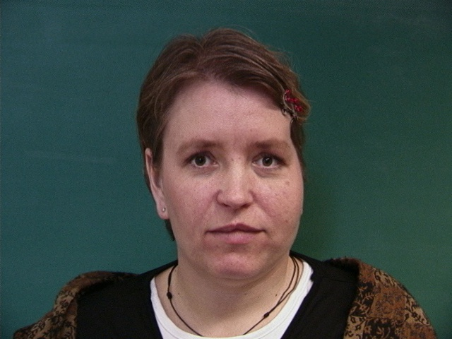
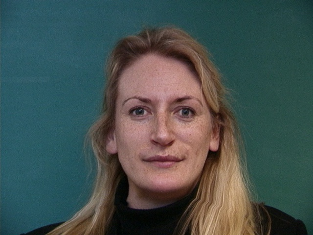
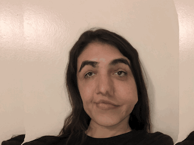
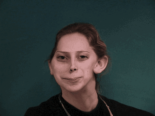
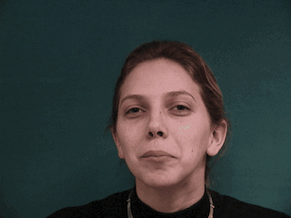

Project 3: Face Morhping
========================

Overview
--------

In this project, I  produce a "morph" animation of my face into someone else's face. I also compute the mean  of a population of faces and extrapolate from the population mean to create a caricature of myself.

 

### Defining Correspondences

I begin by importing two images, one of me and one of Jennifer Lawrence.

<table>
<col width="50%" />
<col width="50%" />
<tbody>
<tr class="odd">
<td align="left">

My face
</td>
<td align="left">

AOC's face
</td>
</tr>
</tbody>
</table>

I use the previously defined aligning method that was provided to us in Project 2 to align and reshape the images into the same measurments. I then manually inputted 25 corresponding points on each image that will be used to create a triangulation of the image for morhping purposes

### Computing the "Mid-way Face"

First, I computed the avergae shape. This involved going through each corressponding points for the images, and calculating the average bewteen the two. Then, I compute the triangulation from the avgerage points and get coressponding points on each image. Then, I calculate the transformation matrix bewteen the mid-way point and the original image, apply this tranfomration on each triangle to attain the warped image, and finally  interpolate the color pixels from original image to get the color of the warped picture.

<table>
<col width="100%" />
<tbody>
<tr class="odd">
<td align="left">

Mid-way face
</td>
</tr>
</tbody>
</table>

 

 

### The Morph Sequence

To get the morphing sequence, I created 30 frames, iterating over a warp\_frac, which affects the shape, and a  dissolve\_frac, which affects the the color.

<table>
<col width="100%" />
<tbody>
<tr class="odd">
<td align="left">

Morph video
</td>
</tr>
</tbody>
</table>

### The "Mean face" of a population

I computed the mean face of females' straight faces from the Danes dataset. I then morphed my face to the mean face, and the  mean face to my geometry.

Mean Face

<table>
<col width="33%" />
<col width="33%" />
<col width="33%" />
<tbody>
<tr class="odd">
<td align="left">

Face 1
</td>
<td align="left">

Face 2
</td>
<td align="left">

Face 3
</td>
</tr>
<tr class="even">
<td align="left">

Face 1 Morphed
</td>
<td align="left"> 

Face 2 Morphed
</td>
<td align="left">

Face 2 Morphed

 </td>
</tr>
</tbody>
</table>

My face morphed to mean geometry

Mean geometry morphed to my face

 

### Caricatures: Extrapolating from the mean

To produce a caricature of myself I used the average points calculated above and then extrapolated from those by computing a new set of points, caricature points.

<table>
<col width="100%" />
<tbody>
<tr class="odd">
<td align="left">

Caricature
</td>
</tr>
</tbody>
</table>

### Bells and Whistles

One: Different Gender

<table>
<col width="33%" />
<col width="33%" />
<col width="33%" />
<tbody>
<tr class="odd">
<td align="left">

Morphing Just Shape
</td>
<td align="left">

Morphing Just Appearence
</td>
<td align="left">

Full Morph
</td>
</tr>
</tbody>
</table>

Two: Different Facial expression

<table>
<col width="33%" />
<col width="33%" />
<col width="33%" />
<tbody>
<tr class="odd">
<td align="left">

Morphing Just Shape
</td>
<td align="left">

Morphing Just Appearence
</td>
<td align="left">

Full Morph
</td>
</tr>
</tbody>
</table>

