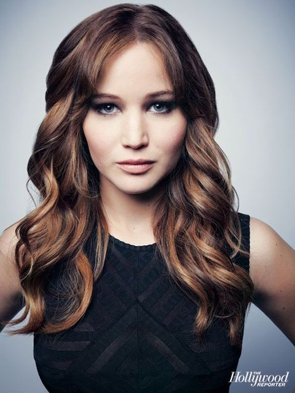
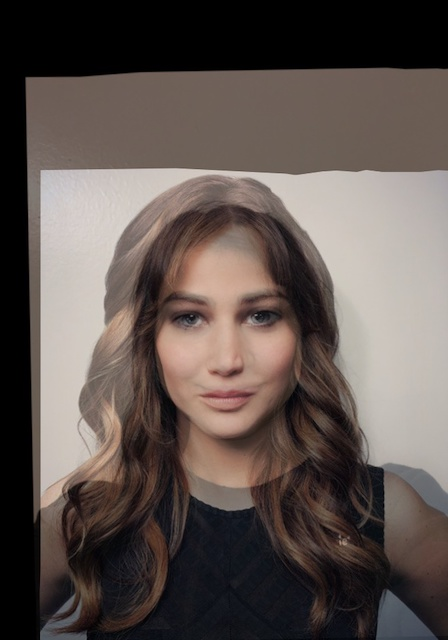
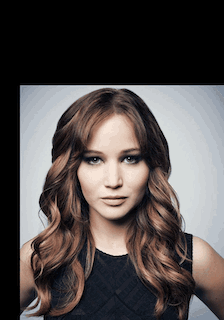
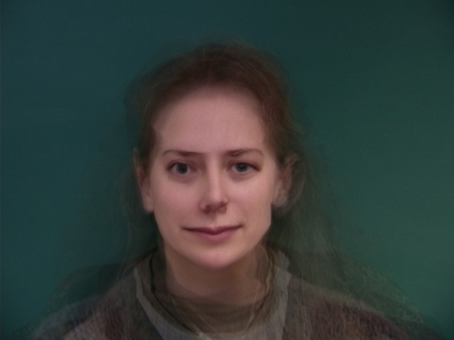
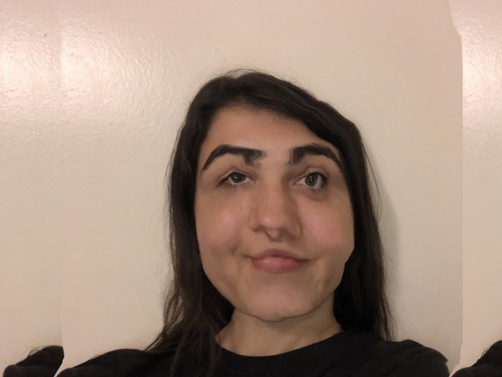

Project 3: Face Morhping
========================

Overview
--------

In this project, I  produce a "morph" animation of my face into someone
else's face. I also compute the mean  of a population of faces and
extrapolate from the population mean to create a caricature of myself.

 

### Defining Correspondences

I begin by importing two images, one of me and one of Jennifer Lawrence.

+--------------------------------------+--------------------------------------+
|     |
| face](inputs/morgan_face.jpeg)       |                                      |
|                                      | AOC's face                           |
| My face                              |                                      |
+--------------------------------------+--------------------------------------+

I use the previously defined aligning method that was provided to us in
Project 2 to align and reshape the images into the same measurments. I
then manually inputted 25 corresponding points on each image that will
be used to create a triangulation of the image for morhping purposes

### Computing the "Mid-way Face"

First, I computed the avergae shape. This involved going through each
corressponding points for the images, and calculating the average
bewteen the two. Then, I compute the triangulation from the avgerage
points and get coressponding points on each image. Then, I calculate the
transformation matrix bewteen the mid-way point and the original image,
apply this tranfomration on each triangle to attain the warped image,
and finally  interpolate the color pixels from original image to get the
color of the warped picture.

+--------------------------------------------------------------------------+
|                                |
|                                                                          |
| Mid-way face                                                             |
+--------------------------------------------------------------------------+

 

 

### The Morph Sequence

To get the morphing sequence, I created 30 frames, iterating over a
warp\_frac, which affects the shape, and a  dissolve\_frac, which
affects the the color.

+--------------------------------------------------------------------------+
|                                           |
|                                                                          |
| Morph video                                                              |
+--------------------------------------------------------------------------+

### The "Mean face" of a population

I computed the mean face of females' straight faces from the Danes
dataset. I then morphed my face to the mean face, and the  mean face to
my geometry.

Mean Face

+--------------------------+--------------------------+--------------------------+
|                       | )                        | )                        |
|                          |                          |                          |
| Face 1                   | Face 2                   | Face 3                   |
+--------------------------+--------------------------+--------------------------+
|             | morph](outputs/avg_morph | s/morph6.jpg)            |
|                          | s/morph4.jpg)            |                          |
| Face 1 Morphed           |                          | Face 2 Morphed           |
|                          | Face 2 Morphed           |                          |
|                          |                          |                          |
+--------------------------+--------------------------+--------------------------+

My face morphed to mean geometry

Mean geometry morphed to my face

 

### Caricatures: Extrapolating from the mean

To produce a caricature of myself I used the average points calculated
above and then extrapolated from those by computing a new set of points,
caricature points.

+--------------------------------------------------------------------------+
|                                  |
|                                                                          |
| Caricature                                                               |
+--------------------------------------------------------------------------+

### Bells and Whistles

One: Different Gender

+--------------------------+--------------------------+--------------------------+
|  |
| )                        | gif)                     |                          |
|                          |                          | Full Morph               |
| Morphing Just Shape      | Morphing Just Appearence |                          |
+--------------------------+--------------------------+--------------------------+

Two: Different Facial expression

+--------------------------+--------------------------+--------------------------+
|     | morph_face/face_app.gif) | _face/face_full.gif)     |
|                          |                          |                          |
| Morphing Just Shape      | Morphing Just Appearence | Full Morph               |
+--------------------------+--------------------------+--------------------------+

