# **Project 4:&nbsp;**Facial Keypoint Detection with Neural Networks
In this project, we learn to use neaural networks to&nbsp;to automatically detect facial keypoints!
### Part 1: Nose Tip Detection
I began by loading in images from&nbsp;the IMM Face Database. Below are sampled image from my custom dataloader visualized with ground-truth keypoints.

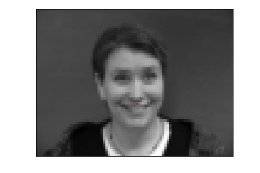
Sample Image 1

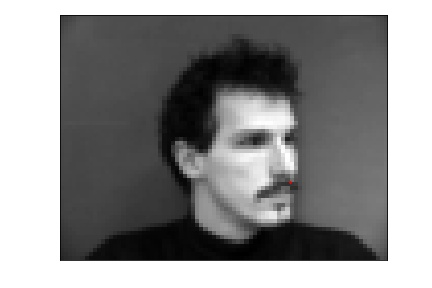
Sample Image 2

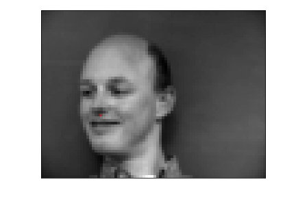
Sample Image 3

&nbsp;
My neural network was as follows:
NoseNet( (conv1): Conv2d(1, 12, kernel_size=(7, 7), stride=(1, 1)) (conv2): Conv2d(12, 16, kernel_size=(5, 5), stride=(1, 1)) (conv3): Conv2d(16, 32, kernel_size=(3, 3), stride=(1, 1)) (pool): MaxPool2d(kernel_size=3, stride=2, padding=0, dilation=1, ceil_mode=False) (fc1): Linear(in_features=576, out_features=200, bias=True) (fc2): Linear(in_features=200, out_features=2, bias=True))
Here is my training and validation accuracy during the training process:

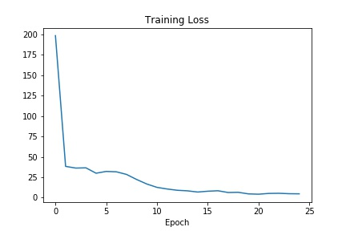
Training Accuracy

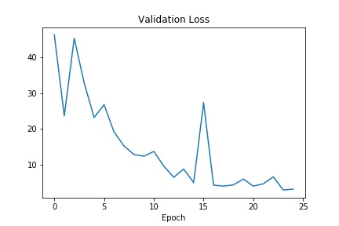
Validation Accuracy

**&nbsp;**
Here are my results:

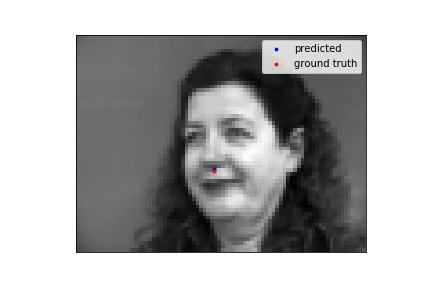
Nose Correctly Detected

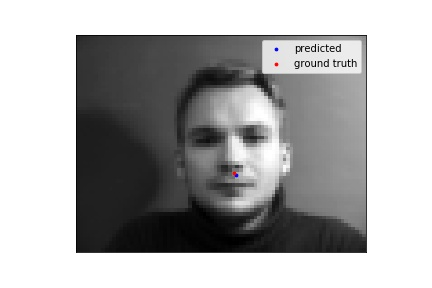
Nose Correctly Detected

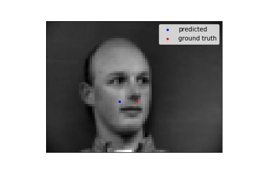
Nose Not Correctly Detected

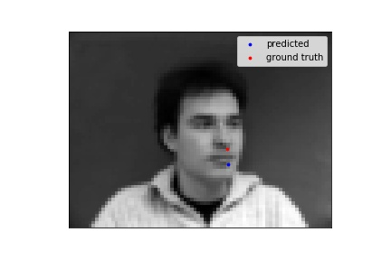
Nose Not Correctly Detected

I think the neural netwok failed in these cases because my training sample was just too small. Perhaps it was the constrast, facial oritentation, or saturation of the photo.
### Part 2: Full Facial Keypoint Detection
I followed a similar structure for this portion &nbsp;of the project as well. To prevent the trained model from overfitting, I augmented the data by rotating the image by random angle between (-10, 10) degrees as well as by randoming chaing the images' brightness, hue, saturation, and contrast. Here are sampled image from your dataloader visualized with ground-truth keypoints.

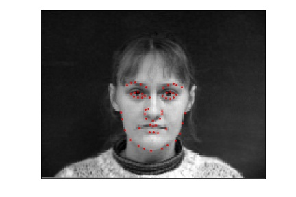
Sample Image 1

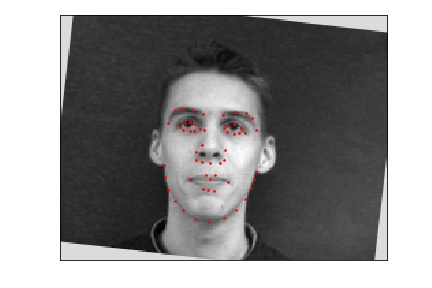
Sample Image 2

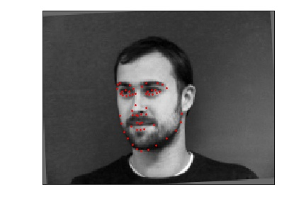
Sample Image 3

&nbsp;
My neural network was a follows:
FaceNet( (conv1): Conv2d(1, 4, kernel_size=(7, 7), stride=(1, 1)) (conv2): Conv2d(4, 8, kernel_size=(5, 5), stride=(1, 1)) (conv3): Conv2d(8, 16, kernel_size=(3, 3), stride=(1, 1)) (conv4): Conv2d(16, 32, kernel_size=(3, 3), stride=(1, 1)) (conv5): Conv2d(32, 56, kernel_size=(3, 3), stride=(1, 1)) (pool): MaxPool2d(kernel_size=2, stride=2, padding=0, dilation=1, ceil_mode=False) (fc1): Linear(in_features=840, out_features=420, bias=True) (fc2): Linear(in_features=420, out_features=112, bias=True))
As for hyperparamters, I used a batch size of 1 and learning of 0.0001. I used the Adam Optimizer and MSE for loss.
&nbsp;
Here is my training and validation accuracy during the training process:

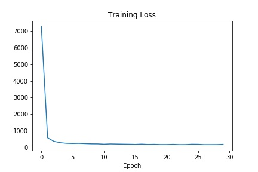
Training Accuracy

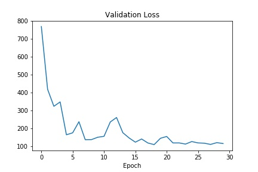
Validation Accuracy

Here are my results:

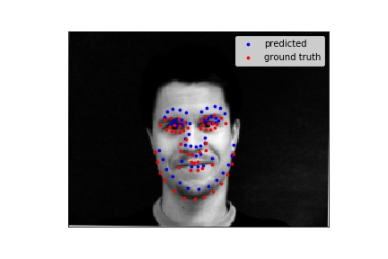
Face Correctly Detected

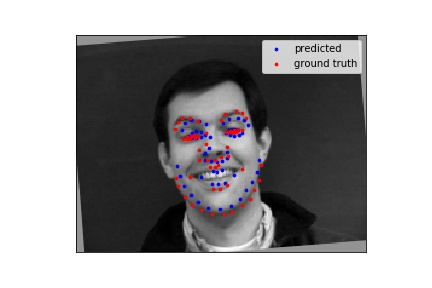
Face Correctly Detected

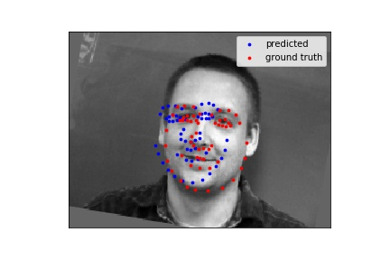
Face Not Correctly Detected

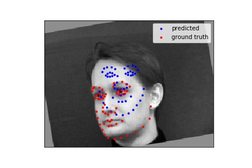
Face Not Correctly Detected

&nbsp;
Again, I think this dataset was rather small to train which can contribute the wrong detections. The missed detections could from exposure, or some other image attribute, being too dramatic or lack there of, cause the image to be an outlier and thus making the neural network less keen to it.
Here is a visualiztion of my learned filters:

  
  
  
  
  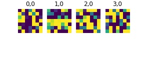
  1st Convolutional Layer
  
  
  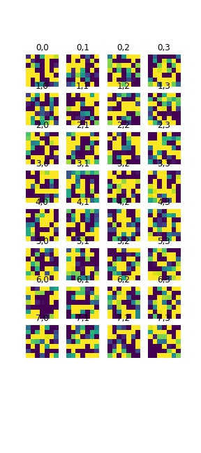
  2nd Convolutional Layer
  
  
  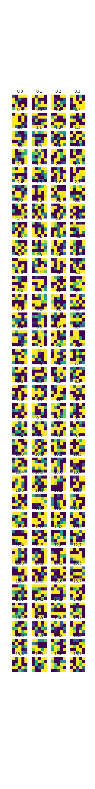
  3rd Convolutional Layer
  
  
  
  
### Part 3: Large Dataset
For this part, I utilized a google colab in addition to a GPU. I sampled images from the 'ibug face in the wild dataset'. I augmented the data for this section as well, again rotating the image and randomly changing image attributes. Below are sampled image from my custom dataloader visualized with ground-truth keypoints.

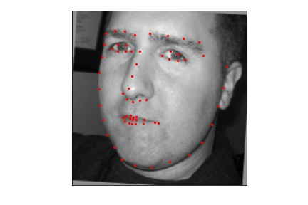
Sample Image 1

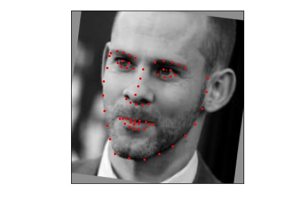
Sample Image 2

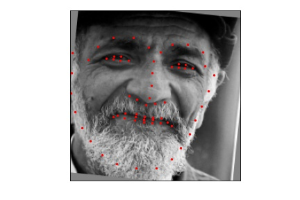
Sample Image 3

&nbsp;
My neural network is the ResNet18 which is predefined PyTorch models. I made two modifications inclusing making the first layer input channel to 1 for as the inputs are grayscale images. I also made last layer's output channel number be 68 * 2 = 136.
I choose learning rate to  lr = 0.001, as used a batch size of 1. I used the same optimizer and loss function as peviously described
Here is my training and validation accuracy during the training process:

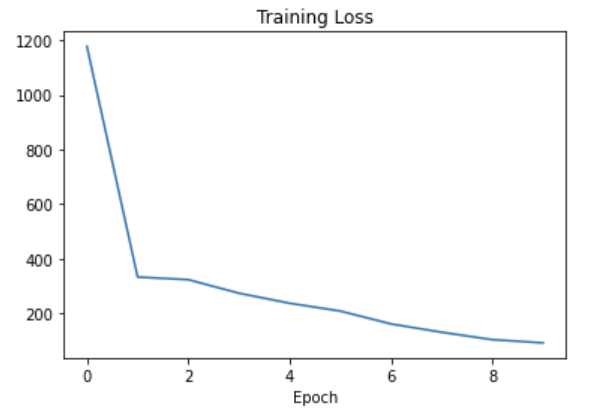
Training Accuracy

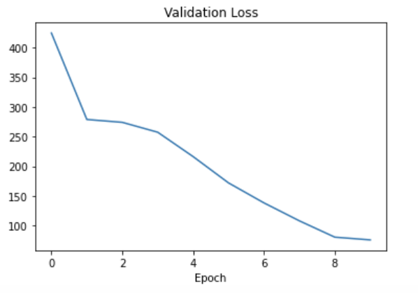
Validation Accuracy

**&nbsp;**
After training the data set, I found the the Mean Squared Error on the whole testing data set to be 15.96319
Here are my results on the testing dataset:

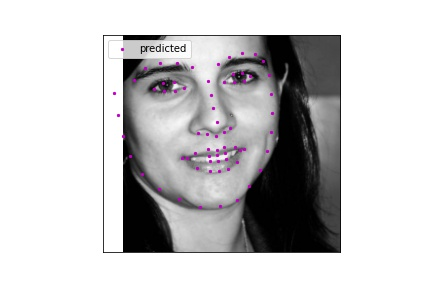
Face Detection

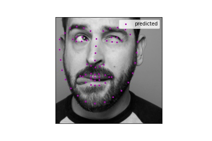
Face Detection

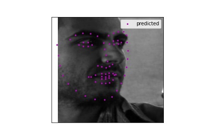
Face Not Detection

&nbsp;
&nbsp;
I then tested my model on 3 personal images. I got them mostly right, the offset is most likely due to either a not perfect model, or variations in my cropping when passing the images through the neural net.

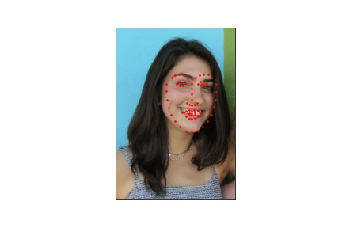
Face Detection

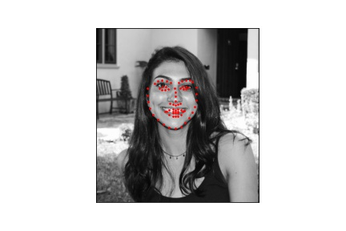
Face Detection

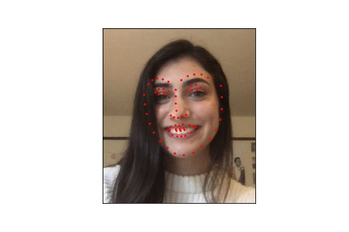
Face Detection
