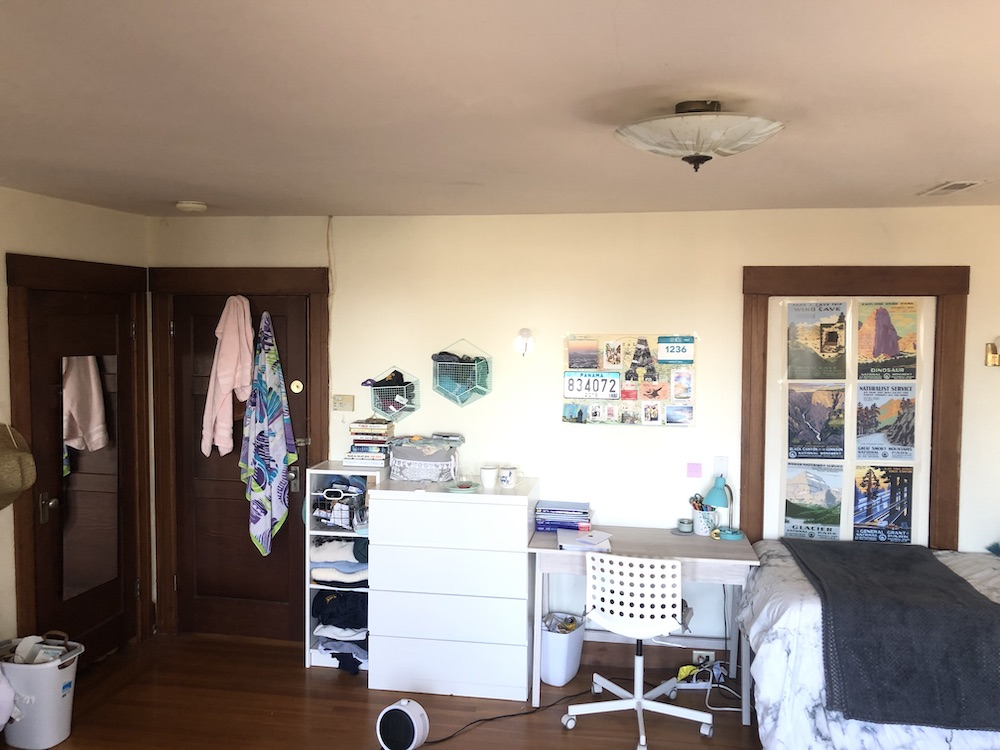
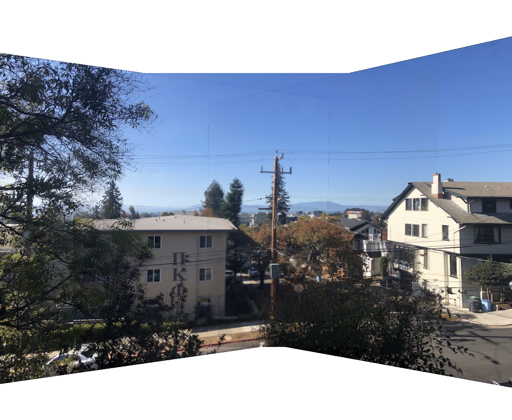
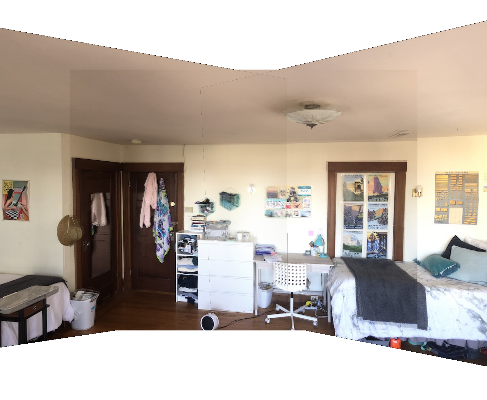

# Project 5.1: Image Warping and Mosaicing

## Shoot the Pictures
Here are the digitized input images I used. The top row is the an outdoor view. It had a stright wire pole and building edges that can &nbsp;be used to make sure the alignment is correct. The bottom row is an indoor view. It has a straight line at the top as well other sharp corners.

Outside Image 1

Outside Image 2

Outside Image 3

Inside Image 1

Inside Image 2

Inside Image 3

## Recover Homographies
I used 10 corresponding points for each image when calculating the transofrmation between two images. &nbsp;Because I used 10 points, in order to avoid an overdetermined system, I&nbsp;solved the homography using least-squares.
## Warp The Image / Image Rectification
Here are the results of my warping. The first image is warping from a trapezoid, or a square in different perspective, to a sqaure. The second is a slanted building into somewhat of a rectangular building.

Trapezoid

Warped Trapezoid into Sqaure

Slanted Building

Warped Slanted Building into a Rectangle

&nbsp;
## Blending Into Mosaic
Below is the result of blending mulitple of my warped images together into one image. I used a linear blending technique and whited out the edges.

Blended Outside Image

Blended Inside Image

## What I Learned 
The most interesting thing that I learned was about creating and applying homography transformations uniformly to an entire image.
It's very interesting how you can apply one transformation for an entire image, just to switch perspective.

Project &nbsp;5.2:&nbsp;Auto Stitching
## Harris Interest Points
Below is the result of getting Harris interest points on my images. The points are shown overlaid a sample images

Harris Interest Points

## Adaptive Non-Maximal Suppression
Below is the result of applying Adaptive Non-Maximal Suppression to the Harris Points

New Points

## Final Outcome
Below is the result after warping and blended the images (with same logic as above), using the auto generated points

Final Mosaic Indoor

Final Mosaic Outdoor

## What I Learned From Part B 
The coolest thing I learned is the matching of features using gradients and blurring! I'm amazing by how something seemingly trivial as SSD math between two patches can match features quite accurately 
