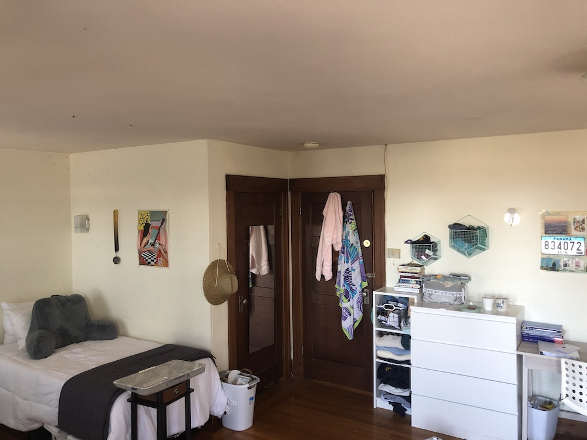
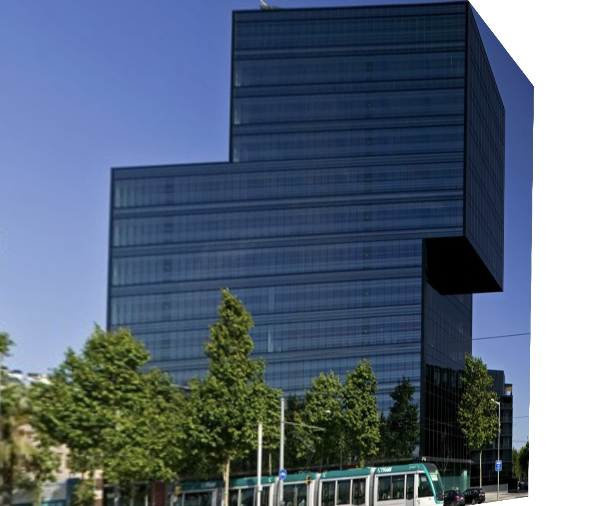
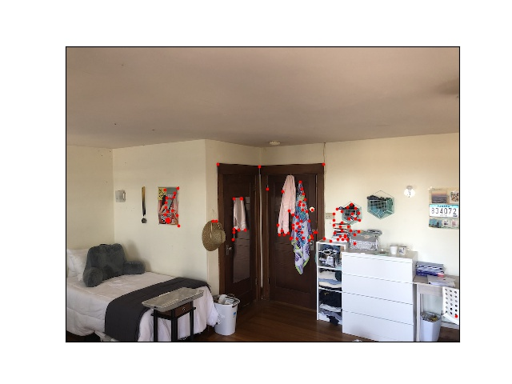
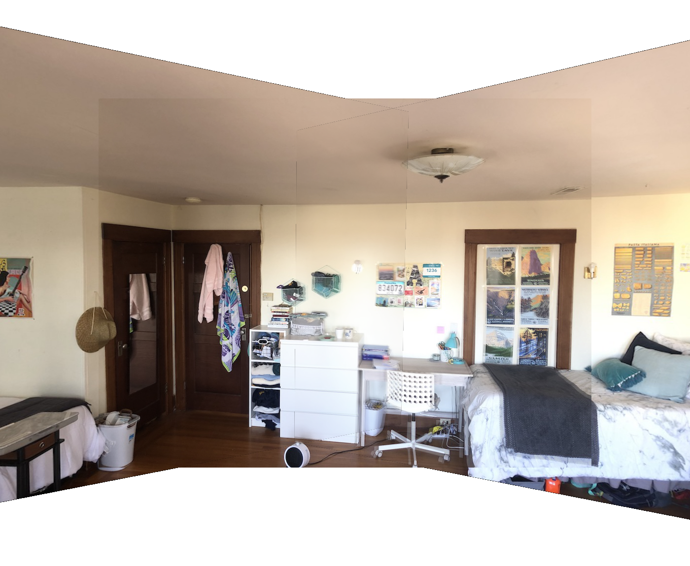
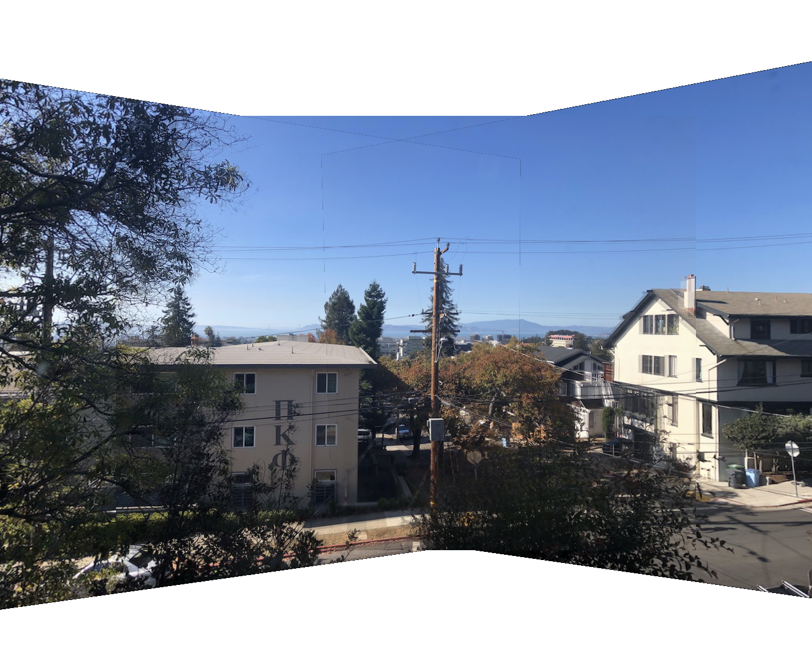

Project  5.1: Image Warping and Mosaicing
=========================================

Shoot the Pictures
------------------

Here are the digitized input images I used. The top row is the an outdoor view. It had a stright wire pole and building edges that can  be used to make sure the alignment is correct. The bottom row is an indoor view. It has a straight line at the top as well other sharp corners.

<table>
<col width="33%" />
<col width="33%" />
<col width="33%" />
<tbody>
<tr class="odd">
<td align="left">Outside Image 1</td>
<td align="left">

Outside Image 2
</td>
<td align="left">

Outside Image 3
</td>
</tr>
<tr class="even">
<td align="left">

Inside Image 1
</td>
<td align="left">

Inside Image 2
</td>
<td align="left">

Inside Image 3
</td>
</tr>
</tbody>
</table>

Recover Homographies
--------------------

I used 10 corresponding points for each image when calculating the transofrmation between two images.  Because I used 10 points, in order to avoid an overdetermined system, I solved the homography using least-squares.

Warp The Image / Image Rectification
------------------------------------

Here are the results of my warping. The first image is warping from a trapezoid, or a square in different perspective, to a sqaure. The second is a slanted building into somewhat of a rectangular building.

<table>
<col width="50%" />
<col width="50%" />
<tbody>
<tr class="odd">
<td align="left">

Trapezoid
</td>
<td align="left">

Warped Trapezoid into Sqaure
</td>
</tr>
<tr class="even">
<td align="left">

Slanted Building
</td>
<td align="left">

Warped Slanted Building into a Rectangle
</td>
</tr>
</tbody>
</table>

 

Blending Into Mosaic
--------------------

Below is the result of blending mulitple of my warped images together into one image. I used a linear blending technique and whited out the edges.

<table>
<col width="100%" />
<tbody>
<tr class="odd">
<td align="left">

Blended Outside Image
</td>
</tr>
<tr class="even">
<td align="left">

Blended Inside Image
</td>
</tr>
</tbody>
</table>

What I Learned
--------------

The most interesting thing that I learned was about creating and applying homography transformations uniformly to an entire image. It's very interesting how you can apply one transformation for an entire image, just to switch perspective.

Project  5.2: Auto Stitching
============================

Harris Interest Points
----------------------

Below is the result of getting Harris interest points on my images. The points are shown overlaid a sample images

<table>
<col width="100%" />
<tbody>
<tr class="odd">
<td align="left">

Harris Interest Points
</td>
</tr>
</tbody>
</table>

Adaptive Non-Maximal Suppression
--------------------------------

Below is the result of applying Adaptive Non-Maximal Suppression to the Harris Points

<table>
<col width="100%" />
<tbody>
<tr class="odd">
<td align="left">

New Points
</td>
</tr>
</tbody>
</table>

Final Outcome
-------------

Below is the result after warping and blended the images (with same logic as above), using the auto generated points

<table>
<col width="100%" />
<tbody>
<tr class="odd">
<td align="left">

Final Mosaic Indoor
</td>
</tr>
</tbody>
</table>

<table>
<col width="100%" />
<tbody>
<tr class="odd">
<td align="left">

Final Mosaic Outdoor
</td>
</tr>
</tbody>
</table>

What I Learned From Part B
--------------------------

The coolest thing I learned is the matching of features using gradients and blurring! I'm amazing by how something seemingly trivial as SSD math between two patches can match features quite accurately
