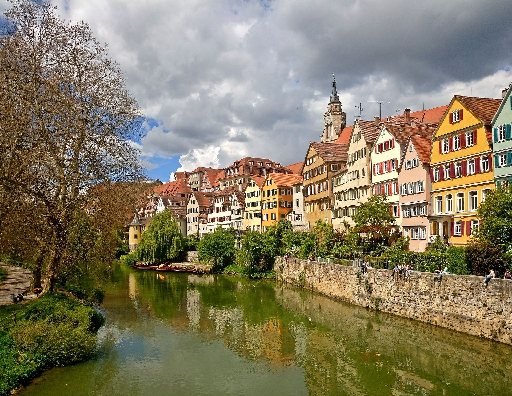
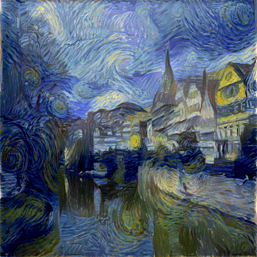
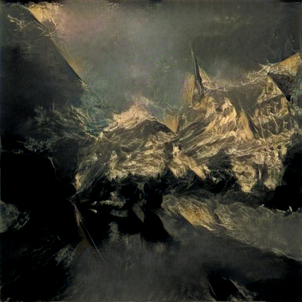
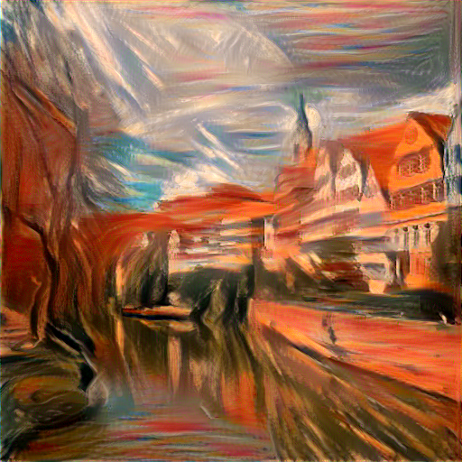
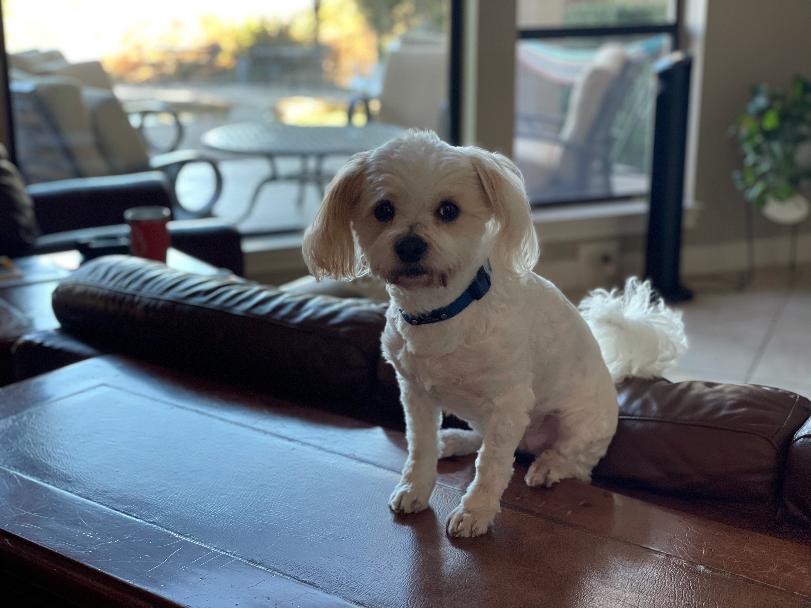
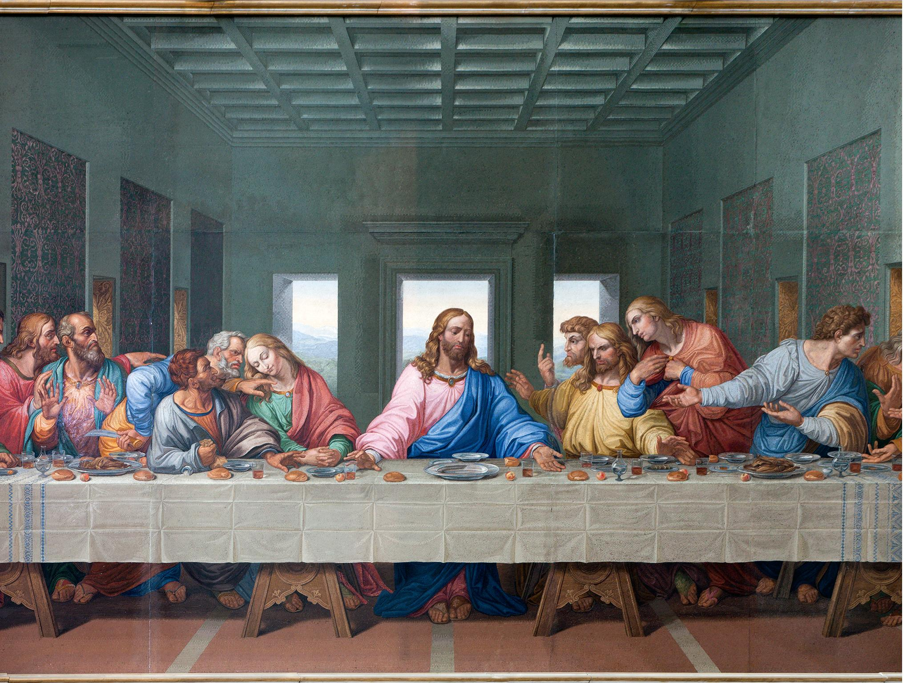
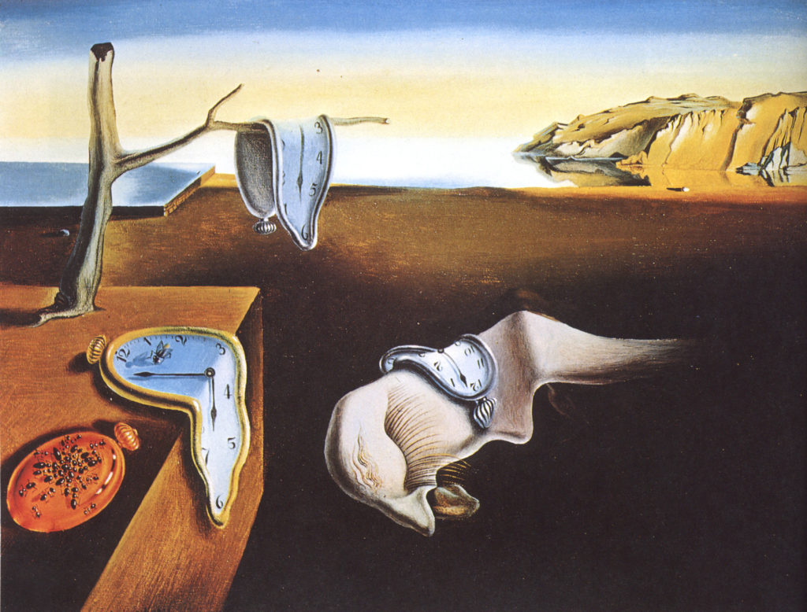
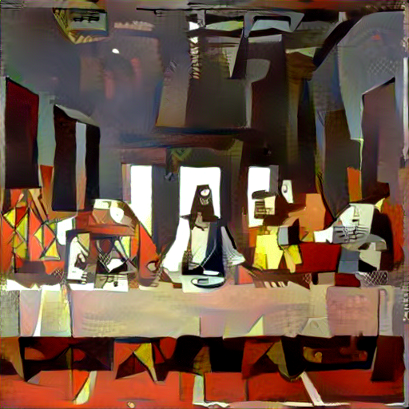

Final Project 1: Reimplementation of A Neural Algorithm of Artistic Style
=========================================================================

Reimplement: A Neural Algorithm of Artistic Style

For this project, I used a PyTorch's pretrained VGG19 feature space. I changed all the maxpooling layers to avgpool, as described in the paper.

Here is the total feature space:

For content activation, I used the second convolutional layer in the 4th block. For style activations, I used the first convolutional  layer in each of the 5 blocks. I initally used optim.lbfgs as our omtimizer but found better results once switching to optim.Adam. I also used a learning rate of 0.01 and found the best results between 1500 and 3000 iterations. A difference between my model and the proposed steps in the paper, is that I did not use a  hite noise image as my input. Instead, I found better results using the content image as my input into the model.

Here are the results of applying 3 different artistic styles to the content of Neckarfront in Tu ̈bingen, German

Content Image:

Style Images:

<table>
<col width="33%" />
<col width="33%" />
<col width="33%" />
<tbody>
<tr class="odd">
<td align="center">

The Starry Night by Vincent can Gogh
</td>
<td align="center">

The Shipwreck of the Minotaur by J.M.W. Turner
</td>
<td align="center">

Der Scheri by Edvard Munch
</td>
</tr>
</tbody>
</table>

Mixed content and style:

<table>
<col width="33%" />
<col width="33%" />
<col width="33%" />
<tbody>
<tr class="odd">
<td align="center">

Starry Night x Neckarfront
</td>
<td align="center">

Shipwreck x Neckarfront
</td>
<td align="center">

Dan Sheri x Neckarfront
</td>
</tr>
</tbody>
</table>

Compared to the images in the paper, I don't think I captured the style as strongly as I would have preferred, even when using an alpha/beta ratio \> 10\^6. 

Here are the results of different styles to my own images

Content Images:

<table>
<col width="33%" />
<col width="33%" />
<col width="33%" />
<tbody>
<tr class="odd">
<td align="center">

Morgan's Dog
</td>
<td align="center">

The Last Supper by Leonardo
</td>
<td align="center">

Chaotic Space by Anastasiya
</td>
</tr>
</tbody>
</table>

Style Images:

<table>
<col width="33%" />
<col width="33%" />
<col width="33%" />
<tbody>
<tr class="odd">
<td align="center">

Persistence of Memory by Salvidor Dali
</td>
<td align="center">

Three Musicians by Picasso
</td>
<td align="center">

Morgan's Dog
</td>
</tr>
</tbody>
</table>

Mixed Content and Style Images: Style Images

<table>
<col width="33%" />
<col width="33%" />
<col width="33%" />
<tbody>
<tr class="odd">
<td align="center">

Dali x Sol/p&gt;</td>
<td align="center">

Picasso x Last Supper
</td>
<td align="center">

Sol x Chaos
</td>
</tr>
</tbody>
</table>

 

As you can see, the last image does not quite work. I believe this is caused by having too much chaos imbedded in the image, and my model cannot pick out and discern these nuances well. In addition to this. The "style" image has no real "style" to it, making it harder to apply to another image
