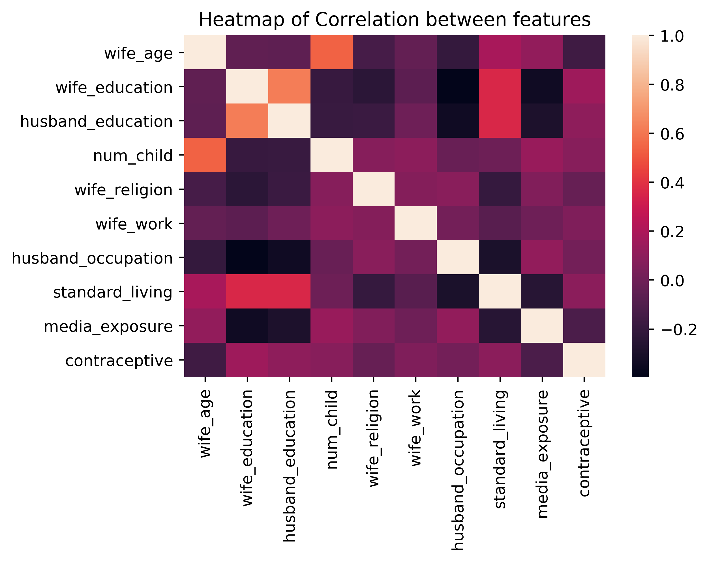
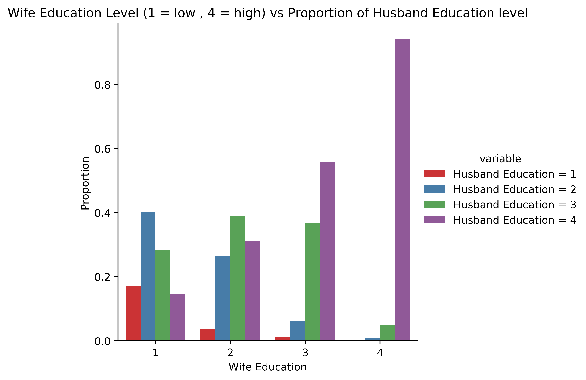
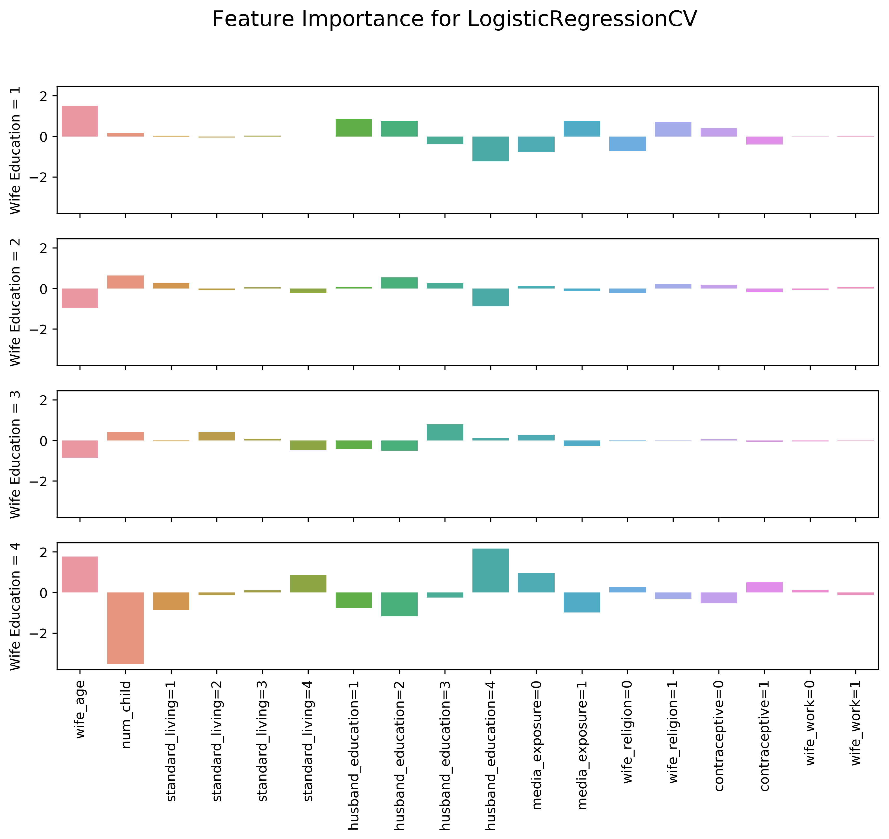
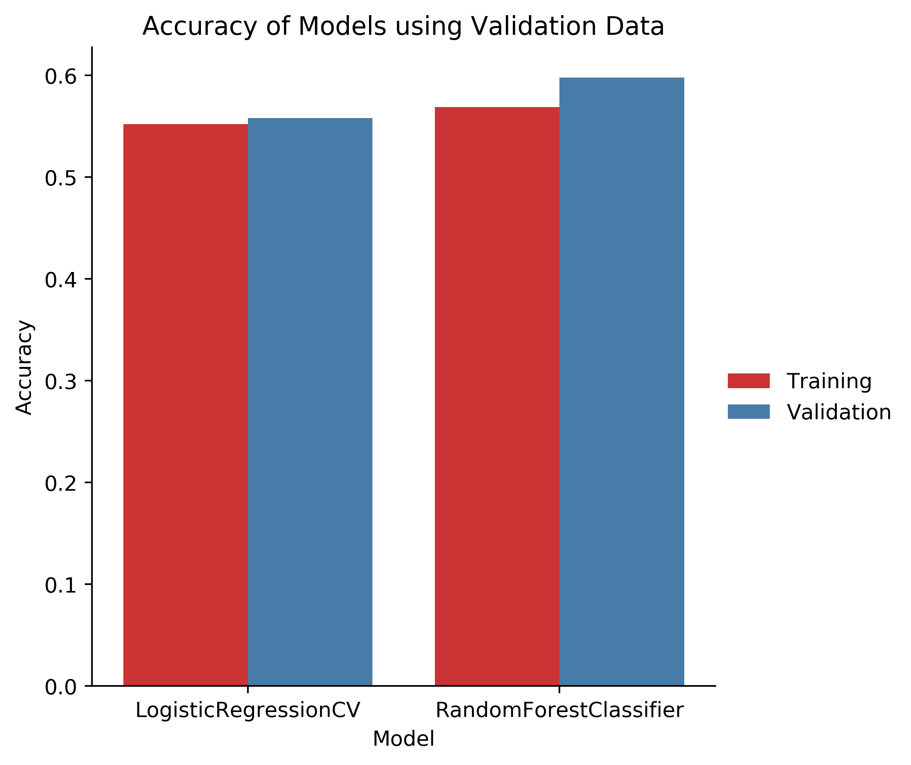
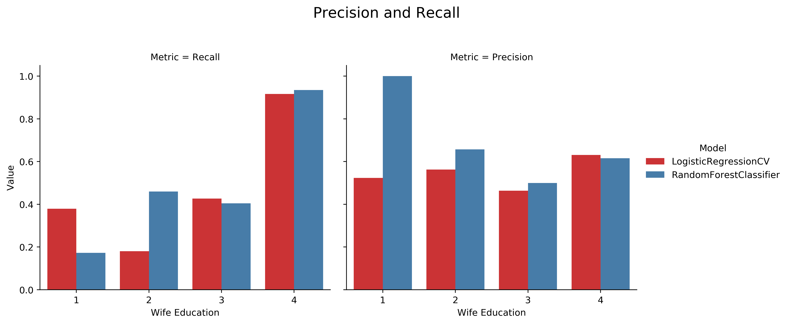
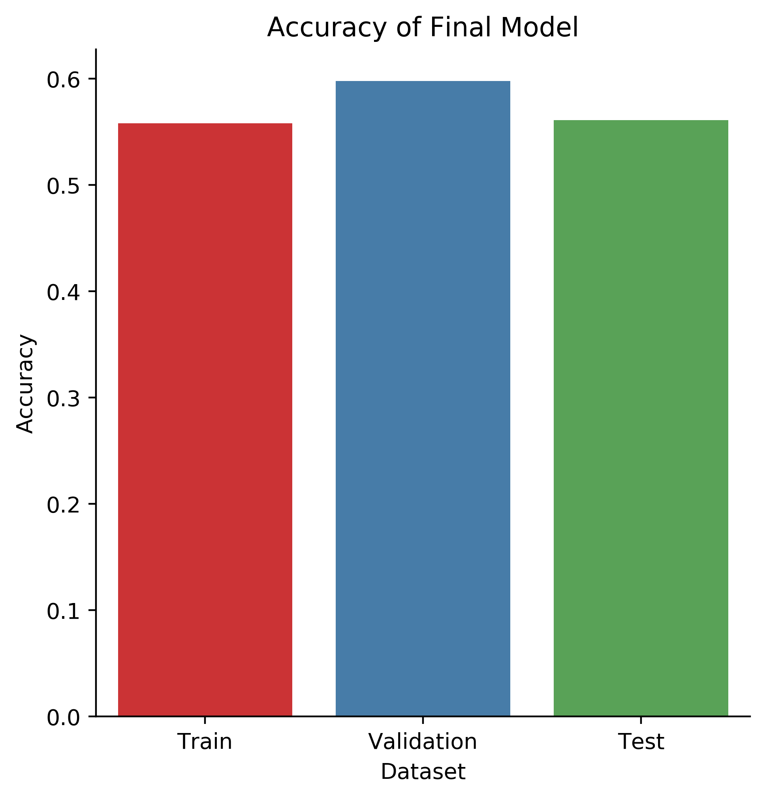

Final Project: Influential Factors on Women’s Education in Indonesia
===========================================================

We explore the factors that best determine what educational level a woman has achieved based on the 1987 National Indonesia Contraceptive Prevalence Survey. We compare and contrast the prediction success or failure for 3 common prediction models: Multi-Class Logistic Regression, Decision Tree, and Random Forest modeling. More detailed information can be found in our report.

Methods
----

#### Data Cleaning
We began  by checking for Null or defaults values and found none. We then cleaned up any outliers. The final stage in the data cleaning process was standardization and one hot encoding. Since a majority of our data was categorical, we had one-hot encode our categorical variables to ensure we did not interpret the magnitude of each numerical category differently. The two numerical categories, 'wife age' and 'num child', were left as is, as the magnitude of their values were inherently important to the data. However, these two numerical features also had to be standardized to ensure wife age and num children values were evaluated on a similar range of -1 to 1.

#### Data Visualization
Examples of plots we created:

#### Preliminary Results
The multi-class classification nature of our central question, inspired the exploration of three distinct models: Multiclass Logistic Regression,  Decision Trees and Random Forest.

Our very initial models, showed preliminary results on the accuracy of train and test data:

• MultiClass Logistic Regression: \
– Training Accuracy: 0.5845 \
– Validation Accuracy: 0.5905  

• Decision Trees:\
– Training Accuracy: 0.9565 \
– Validation Accuracy: 0.49637  

• Random Forest: \
– Training Accuracy: 0.9565 \
– Validation Accuracy: 0.536  

#### Tuning Hyperparameters and Feature Selection

In the process of hypertuning the Random Forest Model, we looked at 3 integral hyperparameters: max depth of the tree, number of iterations, and the max num- ber of samples. In order to ensure the changes observed in accuracy were due to one hyperparameter alone, we car- ried the tuned values of earlier tested hyperparameters into the later ones.

Using the SelectModel package in Sklearn, we identified the features that were most important in each of the models. The following figure depicts the weight of each feature in classifying the different levels of wife education in the Logistic Regression model, however we ran the same analysis on the Random Forest Classifier as well.

#### Comparing Final Models
To further our analysis of the output, we also com- pared the precision and recall of each category of wife education for the respective models. The following figure shows the comparison of accuracy, precision and recall metrics for our predictions.

## Analysis and Conclusion

Based on higher precision and validation accuracy, we ultimately chose the Logistic Regression model as our fi- nal model in prediction. The final stage in our analysis was to try the model on the test data. Figure 6 compares the accuracy of the training, validation, and test accuracy of the Logistic Regression Model.

A big question that followed was: Why is the accuracy so low? We hypothesize that this could have come about from a couple different reasons.

- Class imbalance
- Very small dataset
- Not Representative of Survey
- Contraceptive Focus Dataset
